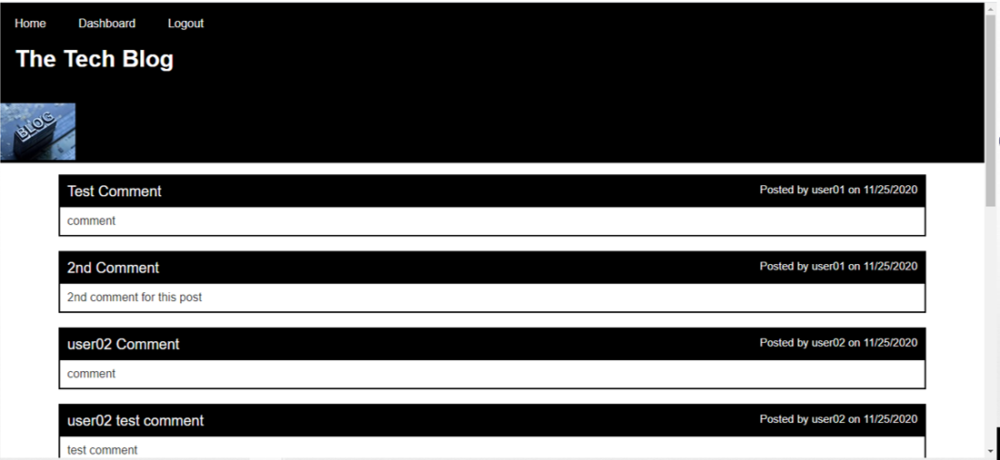

# The Tech Blog

## Live Link
https://mysterious-wildwood-70181.herokuapp.com/

## Contributors
DCampos07
    
## Table of Contents
<li><a href="#description">Description</a></li>  
<li><a href="#installation">Installation</a></li> 
<li><a href="#tech">Technology Stack</a></li> 
<!-- <li><a href="#usage">Usage</a></li>  -->
<li><a href="#demo">Image</a></li> 
<li><a href="#contact">Contact</a></li> 
<!-- <li><a href="#tests">Tests</a></li>  -->
  
<h2 id= "description">Description</h2>
A CMS-style blog site similar to a Wordpress site, where developers can publish their blog posts and comment on other developers’ posts as well.

<h2 id= "installation">Installation</h2>

The following dependencies are required in order to run this app.\
 `npm install mysql2`\
`npm install sequelize`\
`npm install dotenv`
    
<h2 id= "technology">Technology Stack</h2>
<li>express-handlebars</li>
<li>MySql2</li>
<li>Sequelize</li>
<li>dotent package</li>
<li>bcrypt package</li>
<li>express-session</li>
<li>JavaScript</li>
<li>GIT</li>
<li>GitHub</li>
<li>Heroku</li>
  
<!-- <h2 id= "usage">Usage</h2>

 In order to run this application you would need to install MySQL in your environment. \
 Then, from the project root folder enter the sql shell and run the following command: \
 `source db/schema.sql`\
 Exit the sql shell and return to the command line still within your root project folder. \
 Run the following commands:\
 `npm run seed`\
 `npm start` -->

  
<h2 id= "demo">Image</h2>

<iframe src="https://drive.google.com/file/d/1AYDhtIkuhbhlv1WpDcowP6NPcJ1iuMNd/preview" width="640" height="480"></iframe>

<h2 id= "contact">Contact</h2>

<li>Name: Damaris Campos</li> 
<li>Github: https://github.com/DCampos07</li> 
<li>Portfolio: DCampos07.github.io</li>
<li>Email: <a href="mailto:dccampos00@gmail.com" target="_blank">dccampos00@gmail.com</a></li> 
<li>LinkedIn: https://www.linkedin.com/in/damaris-c-870a1472/</li> 

    
<!-- <h2 id= "tests">Tests</h2>

<li>Please use the following link to view the GET ALL ROUTES application demo video:(https://drive.google.com/file/d/1iFNDr1bIfXARgqqRH3AskacCdKPU81Iv/view?usp=sharing)</li>
<li>Please use the following link to view the CATEGORIES Post, Put, and Delete application demo video:(https://drive.google.com/file/d/1cBIGWne8g1QWaX1mVS8WqEqA_SWXieGk/view?usp=sharing)</li>
<li>Please use the following link to view the PRODUCTS Post, Put, and Delete application demo video:https://drive.google.com/file/d/1l3yYm_8WCwbPnv-lOgzbr1igZPMELxuN/view?usp=sharing)</li>
<li>Please use the following link to view the TAGS Post, Put, and Delete application demo video:https://drive.google.com/file/d/1pN3ImPKRg86f5X2TQOKwARH2IJ0HSCB-/view?usp=sharing)</li> -->